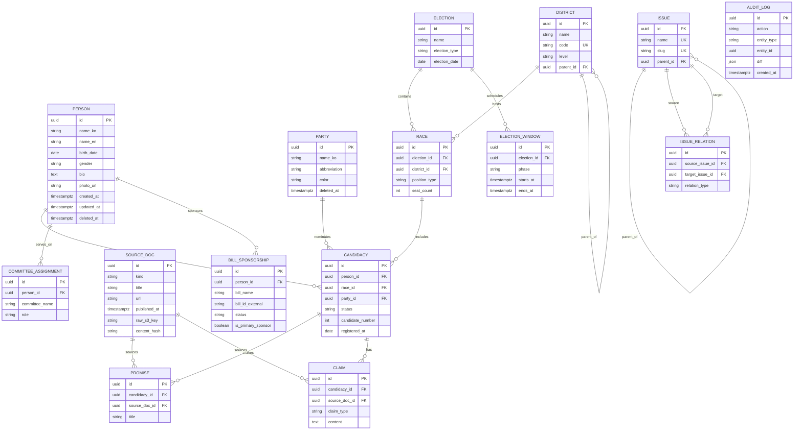

# PolyMap Korea ERD

```mermaid
erDiagram
    PERSON ||--o{ CANDIDACY : runs_as
    PARTY ||--o{ CANDIDACY : nominates
    ELECTION ||--o{ RACE : contains
    DISTRICT ||--o{ RACE : hosts
    DISTRICT ||--o{ DISTRICT : parent_of
    RACE ||--o{ CANDIDACY : includes
    CANDIDACY ||--o{ PROMISE : makes
    CANDIDACY ||--o{ CLAIM : has
    SOURCE_DOC ||--o{ PROMISE : sources
    SOURCE_DOC ||--o{ CLAIM : sources
    ISSUE ||--o{ ISSUE : parent_of
    ISSUE ||--o{ ISSUE_RELATION : source
    ISSUE ||--o{ ISSUE_RELATION : target
    PERSON ||--o{ COMMITTEE_ASSIGNMENT : serves_on
    PERSON ||--o{ BILL_SPONSORSHIP : sponsors
    ELECTION ||--o{ ELECTION_WINDOW : schedules

    PERSON {
        uuid id PK
        string name_ko
        string name_en
        date birth_date
        string gender
        text bio
        string photo_url
        timestamptz created_at
        timestamptz updated_at
        timestamptz deleted_at
    }
    PARTY {
        uuid id PK
        string name_ko
        string abbreviation
        string color
        timestamptz deleted_at
    }
    ELECTION {
        uuid id PK
        string name
        string election_type
        date election_date
    }
    DISTRICT {
        uuid id PK
        string name
        string code UK
        string level
        uuid parent_id FK
    }
    RACE {
        uuid id PK
        uuid election_id FK
        uuid district_id FK
        string position_type
        int seat_count
    }
    CANDIDACY {
        uuid id PK
        uuid person_id FK
        uuid race_id FK
        uuid party_id FK
        string status
        int candidate_number
        date registered_at
    }
    PROMISE {
        uuid id PK
        uuid candidacy_id FK
        uuid source_doc_id FK
        string title
    }
    SOURCE_DOC {
        uuid id PK
        string kind
        string title
        string url
        timestamptz published_at
        string raw_s3_key
        string content_hash
    }
    CLAIM {
        uuid id PK
        uuid candidacy_id FK
        uuid source_doc_id FK
        string claim_type
        text content
    }
    ISSUE {
        uuid id PK
        string name UK
        string slug UK
        uuid parent_id FK
    }
    ISSUE_RELATION {
        uuid id PK
        uuid source_issue_id FK
        uuid target_issue_id FK
        string relation_type
    }
    COMMITTEE_ASSIGNMENT {
        uuid id PK
        uuid person_id FK
        string committee_name
        string role
    }
    BILL_SPONSORSHIP {
        uuid id PK
        uuid person_id FK
        string bill_name
        string bill_id_external
        string status
        boolean is_primary_sponsor
    }
    ELECTION_WINDOW {
        uuid id PK
        uuid election_id FK
        string phase
        timestamptz starts_at
        timestamptz ends_at
    }
    AUDIT_LOG {
        uuid id PK
        string action
        string entity_type
        uuid entity_id
        json diff
        timestamptz created_at
    }
```
